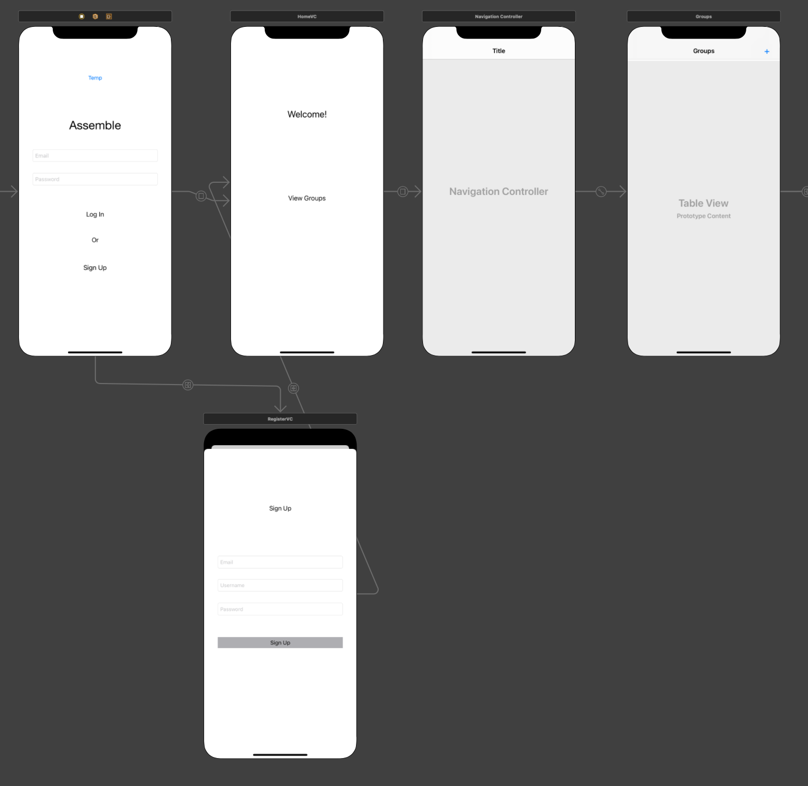
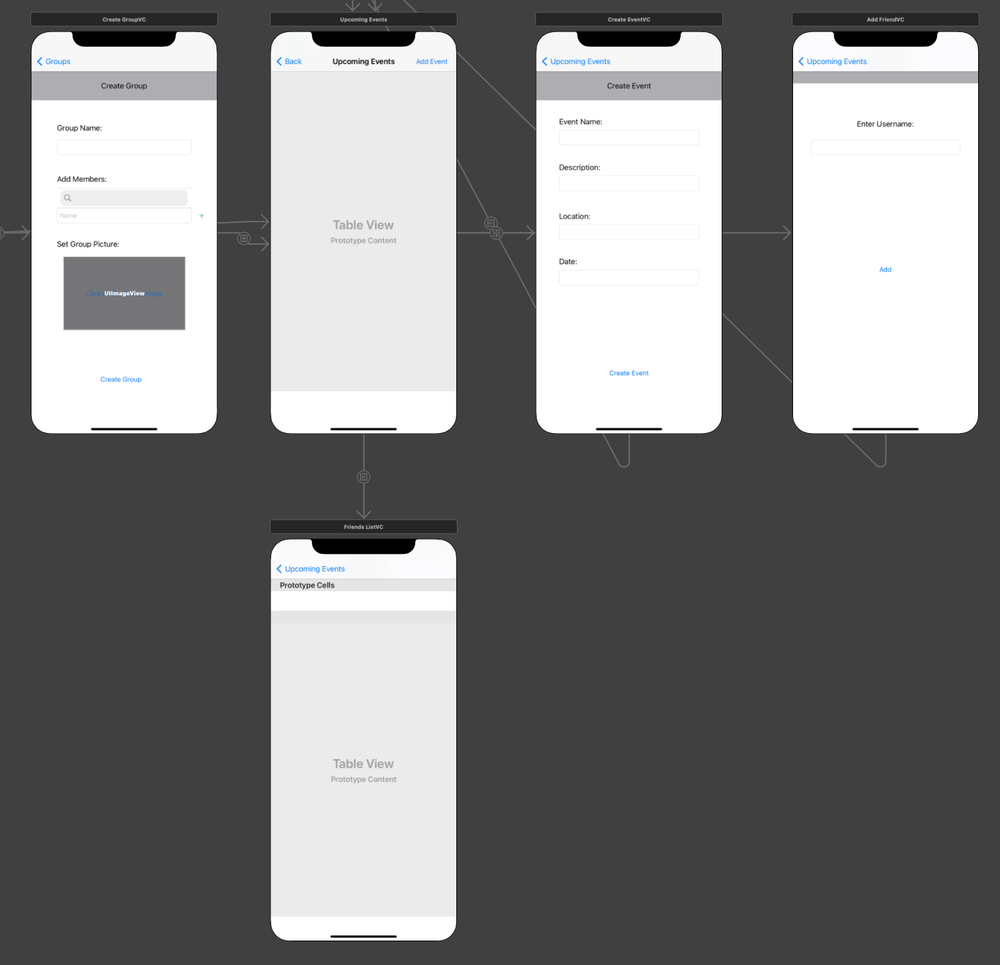

# Assemble
Developed group event scheduling app. New users sign up with email, username, and password. Users can then create groups with other users and create events for 
the group and detail the date, location, title, and description.
I used Firebase specifically Firestore as database to manage users, groups, events.
## User Interface

